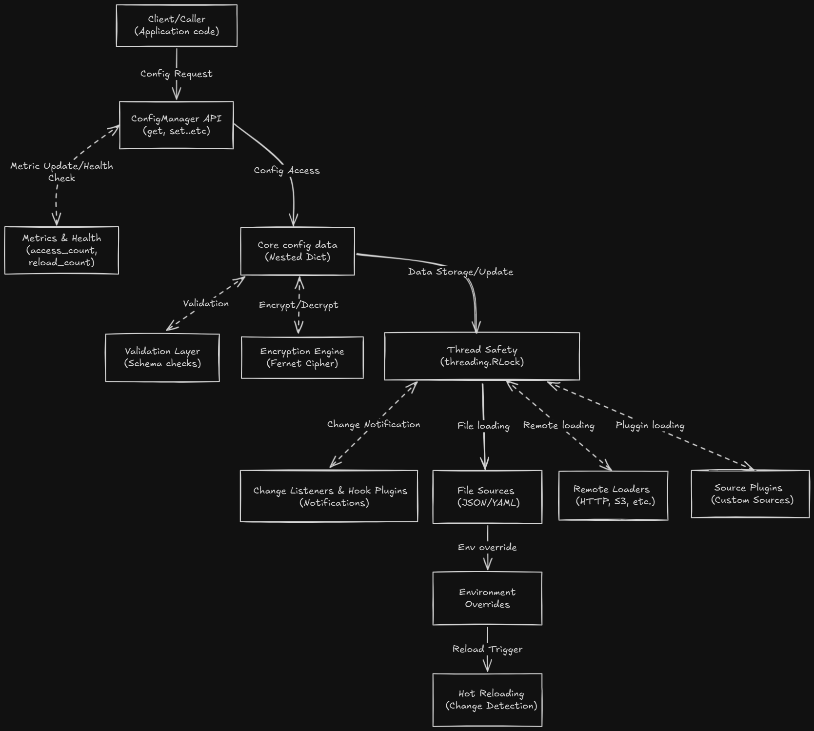

# Configuration Manager – System Design Document

## High-Level System Design Diagram

## Architecture Overview

- **Configuration Manager Core**: Central orchestrator for loading, validating, encrypting, and serving configuration data.
- **File Sources**: Loads configuration from local JSON/YAML files.
- **Remote Loaders**: Pluggable interface for fetching config from remote sources (HTTP, S3, etcd, Consul).
- **Source Plugins**: Extensible mechanism for custom config sources (e.g., Vault, DB).
- **Environment Overrides**: Maps environment variables to config keys for runtime overrides.
- **Validation Layer**: Ensures schema correctness and type safety for critical config sections.
- **Encryption Engine**: Handles encryption/decryption of sensitive values using Fernet.
- **Change Listeners & Hook Plugins**: Event-driven notifications for config changes, supporting custom hooks (e.g., Slack alerts).
- **Metrics & Health Monitoring**: Tracks access patterns, cache stats, reloads, and exposes health status.

## Design Rationale

- **Extensibility**: Pluggable loaders and plugins allow easy integration with new config sources and custom hooks.
- **Thread Safety**: Uses reentrant locks to ensure safe concurrent access in multi-threaded environments.
- **Observability**: Built-in metrics and health checks support monitoring and alerting.
- **Security**: Encryption for sensitive values and support for custom keys/rotation.
- **Robustness**: Graceful error handling, validation, and atomic hot reloads ensure reliability.
- **Separation of Concerns**: Core logic is isolated from usage examples and plugins, supporting clean architecture and testability.

## Integration Points

- **Application Code**: Import and instantiate `ConfigManager` to access configuration.
- **RemoteConfigLoader Interface**: Integrate with external config services (HTTP, S3, etcd, Consul).
- **Source Plugins**: Extend with custom sources (e.g., Vault, database).
- **Hook Plugins**: Register for change notifications (e.g., send alerts, trigger reloads).
- **Environment Variables**: Override config values at runtime for deployment flexibility.
- **Metrics/Health**: Integrate with monitoring systems (Prometheus, Datadog) via exposed metrics and health endpoints.
