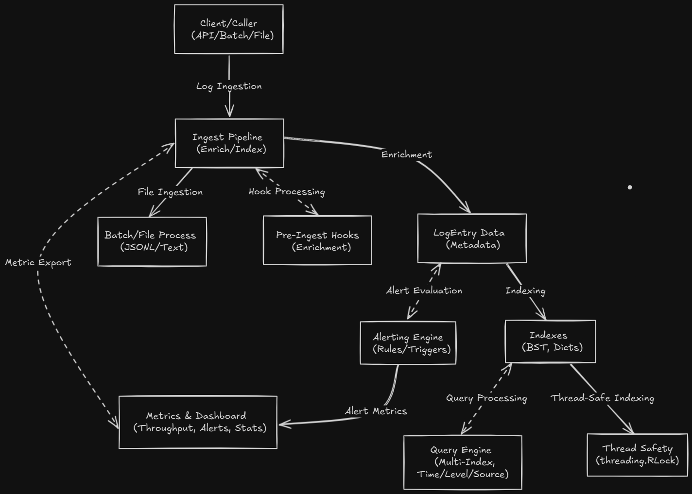

# Log Analytics Engine: System Design Document

## 1. Introduction

The Log Analytics Engine is a production-ready, modular Python system designed for real-time and batch log ingestion, multi-index querying, alerting, and dashboard integration. Built for high-throughput observability in modern backend environments, it supports extensible processing pipelines, thread-safe operations, and comprehensive metrics. This system is tailored for applications requiring scalable log analysis, such as microservices monitoring, security auditing, and performance troubleshooting.

This document provides a detailed overview of the system’s architecture, data flow, algorithms, extensibility, reliability, security, performance considerations, and deployment guidelines, serving as a foundation for implementation and optimization.

## 2. System Overview

The Log Analytics Engine processes logs from various sources, enabling real-time analysis, advanced querying, and proactive alerting. It is designed to handle high-volume log data with efficiency and flexibility, integrating seamlessly with monitoring tools and external systems.

**Key Objectives:**

- Support real-time and batch log ingestion with enrichment.
- Enable multi-index querying with aggregation and pagination.
- Provide configurable alerting with external notifications.
- Export metrics for dashboard integration.
- Ensure thread safety and scalability.
- Offer extensibility for custom indexes and hooks.

## 3. Architecture

The system is composed of interconnected components that facilitate log processing and analysis.

### 3.1 High-Level Architecture Diagram



### 3.2 Components

- **Ingest Pipeline**: Handles log ingestion via API, batch, or files, applying enrichment and indexing.
- **LogEntry Data**: A rich `LogEntry` object with metadata, tags, and computed fields (e.g., severity score).
- **Indexes**: Includes a `BinarySearchTree` (AVL) for time-based indexing and dictionaries for level, source, keyword, and tags.
- **Query Engine**: Supports multi-index queries with filters, sorting, and pagination.
- **Alerting Engine**: Evaluates rules, triggers alerts, and notifies external systems via hooks.
- **Batch/File Process**: Ingests logs from files with performance tracking.
- **Metrics & Dashboard**: Exports statistics for Prometheus/Grafana integration.
- **Thread Safety**: Uses `threading.RLock` for concurrent access.
- **Pre-Ingest Hooks**: Extensible functions for log enrichment/filtering.

## 4. Data Flow

1. **Client Interaction**: Logs are ingested via API, batch, or file sources.
2. **Ingest Pipeline**: Applies `[Ingest]` - Accepts logs, `[Enrich]` - Runs pre-ingest hooks, and `[Index]` - Stores logs in indexes.
3. **LogEntry Data**: Populates metadata and computed fields.
4. **Indexes**: Updates time (BST), level, source, keyword, and tags indexes.
5. **Query Engine**: Processes `[Query]` - Executes multi-index queries with aggregation and pagination.
6. **Alerting Engine**: Evaluates `[Alert]` - Checks rules on ingestion, triggers/persists alerts, and notifies via hooks.
7. **Metrics & Dashboard**: Exports `[Dashboard]` - Metrics for monitoring and visualization.
8. **Thread Safety**: Ensures all operations are locked for concurrency.
9. **Batch/File Process**: Handles file-based ingestion with performance metrics.

## 5. Key Algorithms and Design Patterns

### 5.1 AVL Tree Indexing

- **Algorithm**: Self-balancing Binary Search Tree with rotations (left, right) to maintain O(log n) height.
- **Time Complexity**: O(log n) for insert and range queries.
- **Implementation**: Used in `time_index` for efficient timestamp-based searches.

### 5.2 Multi-Index Querying

- **Algorithm**: Filters logs across indexes (e.g., tags set intersection) and sorts/paginates results.
- **Time Complexity**: O(n) for full scan; O(log n + k) with indexes (k = matches).
- **Implementation**: `query_logs` combines index lookups and post-filtering.

### 5.3 Alert Evaluation

- **Algorithm**: Counts matching logs in a time window, applies threshold/cooldown checks.
- **Time Complexity**: O(n) for window scan.
- **Implementation**: `_check_alerts` triggers `Alert` objects.

### 5.4 Thread Safety

- **Pattern**: Reentrant locking with `threading.RLock`.
- **Implementation**: Protects all index and alert operations.

### 5.5 Enrichment Hooks

- **Pattern**: Chain of Responsibility.
- **Implementation**: `pre_ingest_hooks` processes logs sequentially.

### 5.6 Aggregation

- **Algorithm**: Uses `Counter` for histograms and top-N; `defaultdict` for grouping.
- **Implementation**: `aggregate_logs` computes statistics.

## 6. Extensibility and Customization

- **Custom Indexes**: Extend with new fields (e.g., `user_id`) via additional dictionaries.
- **Enrichment Hooks**: Add custom logic (e.g., geo-IP parsing) via `add_pre_ingest_hook`.
- **Alerting Hooks**: Integrate with webhooks/email via `add_alert_notification_hook`.
- **Dashboard APIs**: Export metrics in Prometheus or JSON formats.
- **Persistence**: Extend `persist_alerts_to_file` for databases.

## 7. Reliability and Fault Tolerance

- **Thread Safety**: Prevents data races with `RLock`.
- **Batch Processing**: Handles large files with error logging.
- **Alert Persistence**: Saves/reloads alerts for recovery.
- **Error Handling**: Logs parsing failures without halting ingestion.

## 8. Security Considerations

- **Input Validation**: Sanitizes log data in `LogEntry`.
- **Access Control**: Restricts APIs via external authentication.
- **Alert Security**: Secures notification endpoints.

## 9. Performance Considerations

- **O(log n) Indexing**: AVL tree ensures efficient time-based queries.
- **Batch Ingestion**: Optimizes file processing with bulk operations.
- **Metrics Overhead**: Lightweight counters, exportable on demand.

### 9.1 Performance Metrics

- Tracks `total_logs`, `levels`, `sources`, `keywords`, via `get_stats`.

## 10. Deployment and Integration

### 10.1 Installation

```bash
pip install .
```

**Dependencies**:

- Python 3.7+
- Standard library only

### 10.2 Integration

Use as a module:

```python
from log_analytics import LogAnalyticsEngine
engine = LogAnalyticsEngine()
engine.ingest_log(LogEntry(timestamp="...", level="INFO", message="..."))
```

### 10.3 Deployment Guidelines

- **Docker**:

  ```dockerfile
  COPY logs/ /app/logs/
  CMD ["python", "-m", "log_analytics"]
  ```

- **Kubernetes**: Deploy as a pod with log volume mounts.
- **Configuration**: Via hooks and API parameters.

### 10.4 Testing

Tests in `tests/`:

- **Unit Tests**: Indexing, querying.
- **Integration Tests**: Alerts, batch processing.
Run: `python -m unittest discover tests`

## 11. Use Cases

1. **Real-Time Monitoring**: Analyze logs as they arrive.
2. **Historical Analysis**: Process batch files for trends.
3. **Alerting**: Detect anomalies and notify teams.
4. **Dashboarding**: Visualize metrics in Grafana.

## 12. Limitations and Future Improvements

- **Scalability**: Single-node; could use distributed indexes.
- **Storage**: In-memory; add disk persistence.
- **Query Optimization**: Add caching for frequent queries.
- **Alerting**: Support rule scheduling.

## 13. References

- [README.md](./README.md): API and usage.
- [Implementation File](./log_analytics_engine.py): Source code.
- [AVL Tree](https://en.wikipedia.org/wiki/AVL_tree)
